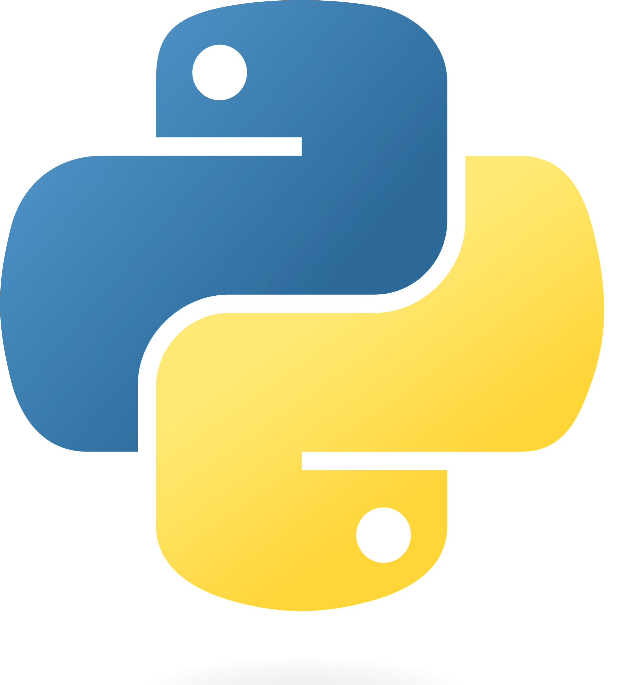

# Introduction to Python Programming

## What is Python?

Python is a programming language. It is a tool that allows us to communicate with computers and tell them what to do. Python is a very popular programming language, and is used by many companies and organizations, including Google, NASA, and the CIA.

## Why Python?

Python is a great language for beginners. It is easy to read and write, and it is very powerful. Python is also a very popular language, so there are many resources available to help you learn.

## What can you do with Python?

Python can be used for many things. It can be used to create websites, games, and even artificial intelligence. Python is also used in many scientific fields, including astronomy, biology, and physics.
